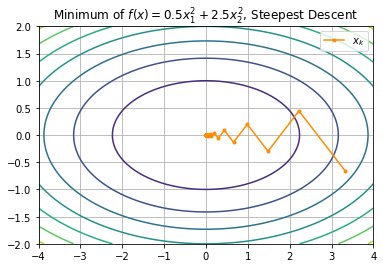
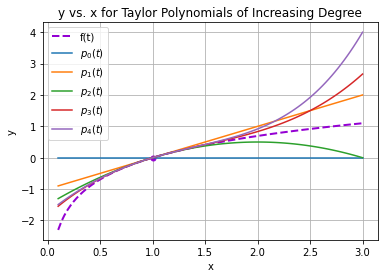
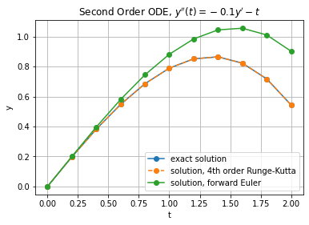
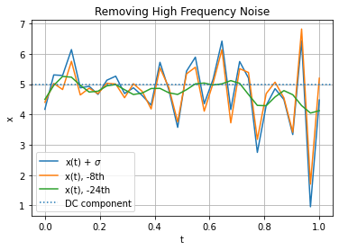

# numerics-python

Jupyter notebooks with notes and examples implemented in numpy and scipy of the algorithm pseudocode from the textbook _Scientific Computing_ by Michael Heath (Heath, 2018).

 

 

I compiled these notebooks while taking [CS 450 Numerical Analysis](https://cs.illinois.edu/academics/courses/cs450) at UIUC and they come without any guarantee of accuracy or endorsement by the textbook author. I started a similar repository with end of chapter review questions at [marcoemorais/numerics-review](https://github.com/marcoemorais/numerics-review).

If you find this repo helpful, please star this repository. Thank you!

```tex
@book{heath2018scientific,
  title={Scientific computing: an introductory survey},
  author={Heath, Michael T},
  volume={80},
  year={2018},
  publisher={SIAM}
}
```

## Chapter Notes

[01-Scientific-Computing](01-Scientific-Computing.ipynb)

[02-Systems-of-Linear-Equations](02-Systems-of-Linear-Equations.ipynb)

[03-Linear-Least-Squares](03-Linear-Least-Squares.ipynb)

[04-Eigenvalue-Problems](04-Eigenvalue-Problems.ipynb)

[05-Nonlinear-Equations](05-Nonlinear-Equations.ipynb)

[06-Optimization](06-Optimization.ipynb)

[07-Interpolation](07-Interpolation.ipynb)

[08-Numerical-Integration-and-Differentiation](08-Numerical-Integration-and-Differentiation.ipynb)

[09-Initial-Value-Problems-for-ODE](09-Initial-Value-Problems-for-ODE.ipynb)

[10-Boundary-Value-Problems-for-ODE](10-Boundary-Value-Problems-for-ODE.ipynb)

[11-Partial-Differential-Equations](11-Partial-Differential-Equations.ipynb)

[12-Fast-Fourier-Transform](12-Fast-Fourier-Transform.ipynb)

[13-Random-Numbers-and-Stochastic-Simulation](13-Random-Numbers-and-Stochastic-Simulation.ipynb)
